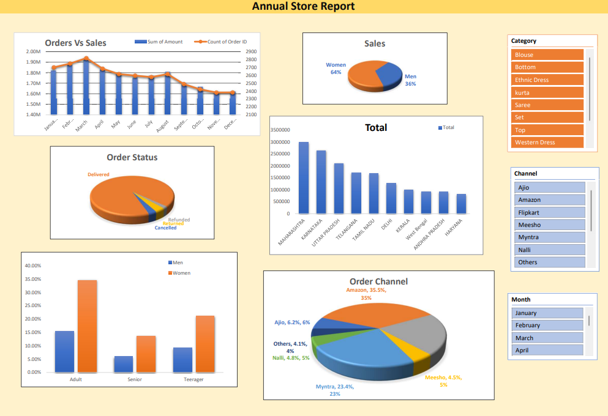

# 📊 Sales Data Analysis | Microsoft Excel

This project focuses on analyzing a company's sales data for a particular year to identify key trends, customer behavior, and business insights. The objective is to derive actionable recommendations that can help improve sales performance in the following year.

## 📁 Dataset Information

- Total Records: 31048
- Total Features (Columns): 21

## 🎯 Problem Statement
Analyze historical sales data to find patterns and insights that support data-driven decision-making and help increase sales in the next year.

## 🛠️ Tools Used
- Microsoft Excel

## 🔍 Analysis Performed
- Cleaned and preprocessed the raw sales dataset
- Compared monthly sales and order trends
- Analyzed sales distribution by gender
- Evaluated order status (Delivered, Cancelled, Refunded, and Returned)
- Identified top-performing states based on total sales
- Compared purchasing behavior across different age groups and genders
- Analyzed sales contribution from different sales channels (Amazon, Myntra, Ajio, Flipkart, etc.)
- Built an interactive Excel dashboard using Pivot Tables, Pivot Charts, and Slicers for dynamic filtering

## 💡 Key Outcomes
- Identified top-performing products and regions
- Highlighted low-performing areas requiring improvement
- Generated insights to support strategic planning for the next year's sales
- Presented findings through an easy-to-understand Excel dashboard

## 📂 Dashboard Preview

